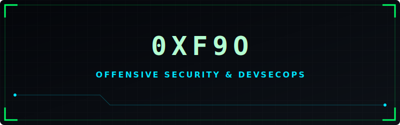
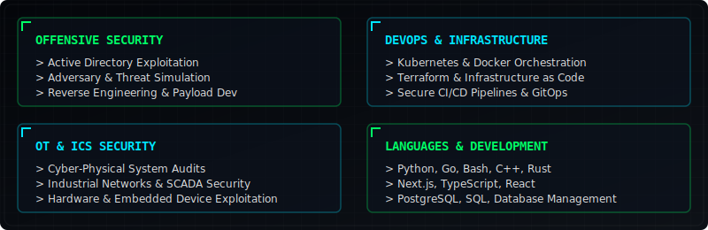
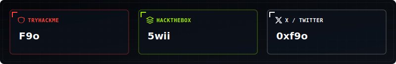

<div align="center">
  
</div>

<br>

```ini
[SYSTEM INFO]
user        = 0xf9o (Faisal Alnumani)
title       = Offensive Security | DevSecOps & Infra | OT Security
trajectory  = Bridging cyber-physical systems (OT/ICS) and active defense
mantra      = "Automate the infrastructure, simulate the adversary, secure the physical layer."
```

---

## WHOAMI

```bash
$ cat /etc/identity
```

I build offensive security tools and DevOps-driven infrastructure focused on adversary simulation and automation. With background knowledge in backend systems, IoT, and automation, my work bridges the gap between software reliability and threat emulation.

My primary focus is securing Operational Technology (OT Security) — developing defense-in-depth and attack simulation strategies for industrial and physical environments.

- Current Focus: Offensive Engineering, Threat Simulation, and DevSecOps.
- The Goal: Architecting resilient security postures for Industrial Control Systems (ICS) and OT environments.
- Active Projects: Custom exploit payloads, scalable simulation networks, infrastructure-as-code automation.

---

## CORE SKILLS

<div align="center">
  
</div>

---

## SECURITY & SOCIAL PLATFORMS

<div align="center">
  
</div>

<p align="center">
  <a href="https://tryhackme.com/p/F9o">TryHackMe</a> | 
  <a href="https://app.hackthebox.com/users/5wii">HackTheBox</a> | 
  <a href="https://x.com/0xf9o">X / Twitter</a>
</p>

---

## CONTACT

```bash
$ cat /etc/contact
```

- Email: Faisal Alnumani (your-email@example.com)
- LinkedIn: [Faisal Alnumani](https://linkedin.com/in/your-profile)
- X (Twitter): [@0xf9o](https://x.com/0xf9o)
- PGP Key: 0xDEADBEEF...

---

